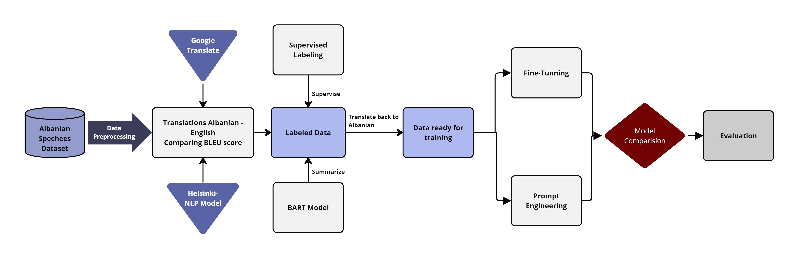
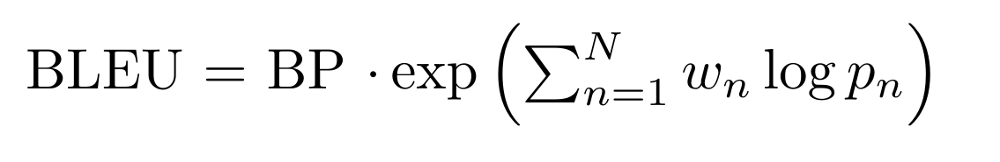
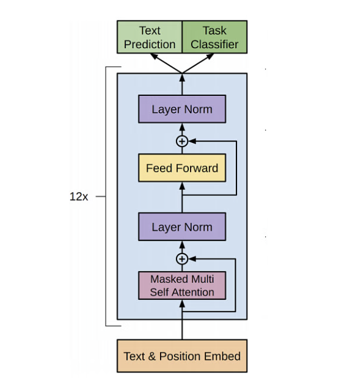

# Comparative Analysis of Fine-Tuning vs. Multishot Prompting Techniques for Summarizing Albanian Parliamentary Speeches

## Introduction

This project evaluates two methodologies in Natural Language Processing (NLP) to summarize Albanian parliamentary speeches: fine-tuning a pre-trained Language Model (LM) and multishot prompt engineering. The aim is to determine a cost-effective yet accurate approach for summarizing legislative discussions from the Kosovo Parliament in Albanian.

### Objectives

1. **Fine-Tuning a Language Model:**
   - Implement a fine-tuning approach on a pre-trained model to generate accurate summaries from Albanian texts, assessing its effectiveness and resource implications.
   
2. **Exploring Prompt Engineering Techniques:**
   - Evaluate zero-shot, one-shot, and multi-shot prompt engineering to understand their efficiency and performance without extensive computational resources.

### Comparison Objective

The core objective is to compare fine-tuning and prompt engineering in terms of cost, performance, and practicality, to decide if the investment in fine-tuning is justified or if prompt-based approaches yield comparable outcomes.

### Data

1. **Data Source and Preparation:**
   - Original speeches were sourced from the Kosovo Assembly's website, initially in PDF format and converted to text via OCR, introducing potential errors which were later cleaned manually and published in  hugging face: [Kushtrim/Kosovo-Parliament-Transcriptions](https://huggingface.co/datasets/Kushtrim/Kosovo-Parliament-Transcriptions).

2. **Dataset Structure:**
   - The data comprises attributes like `text`, `speaker`, `date`, and `id`, with speeches across multiple languages due to the multilingual nature of the Assembly's proceedings.

## Data Preprocessing

#### Creating Labeled Data

The primary challenge in our project is the absence of labeled data suitable for training a summarization model directly. As our dataset, the "Kosovo-Parliament-Transcriptions," is primarily unlabeled, our initial task involves generating this crucial labeled dataset.

#### Preparing the Data
- **Data Cleaning**: Ensure the cleanliness of the dataset by removing entries with missing or incomplete data
- **Language Detection and Filtering**: Speeches not detected as Albanian (`sq`) are filtered out
- **Token Count and Speech Filtering**: Filter speeches based on token counts to ensure that they are of suitable length for summarization
  - The filtering from 200 to 1024 tokens nsures that the data is neither too sparse for meaningful summarization nor too lengthy for processing efficiency.
- **Data Sampling**: From the filtered dataset, a random sample of 1000 speeches is selected. This sample size is chosen to maintain a diverse range of topics and discussions, ensuring that the model is not biased towards any particular type of speech or session.
- **Translation for Summarization**: Translate Albanian speeches into English to leverage advanced NLP models optimized for English, enhancing model compatibility and improving summary quality.
  - **BLEU Score Evaluation**: Measure translation performance with BLEU scores, using the formula to assess precision and fluency.
      <!-- Adjust 'width' as needed -->
  - Google Translate achieved an average BLEU score of 0.45, surpassing the Helsinki-NLP opus-mt model's 0.30, affirming its higher quality and accuracy for project use.

## Summarization Model Setup and Execution

This phase employed a BERT model for initial summarization of English-translated Albanian parliamentary speeches, followed by manual review to ensure accuracy and contextual relevance.

#### Process Overview

- **Initial Summarization**: Utilized a BERT model to auto-generate summaries for the dataset of translated speeches.
- **Manual Supervision**: Summaries were manually checked and refined to capture the speeches' essential details accurately.
- **Dataset Preparation**: These corrected summaries, translated back into Albanian, formed a labeled dataset for training and fine-tuning.

#### Choice of Model

We selected the `facebook/bart-large-cnn` model for its robust performance in text summarization, making it highly suitable for processing legislative speeches. Introduced in the paper by Lewis et al., titled [BART: Denoising Sequence-to-Sequence Pre-training for Natural Language Generation, Translation, and Comprehension](https://arxiv.org/abs/1910.13461), BART operates as a transformer-based encoder-decoder (seq2seq) model. It uniquely combines a bidirectional encoder, similar to BERT, with an autoregressive decoder akin to GPT, optimizing both comprehension and generation capabilities.

The model was pre-trained using a novel denoising approach aimed at reconstructing corrupted texts, which significantly enhances its ability to understand and generate contextually rich summaries. Specifically fine-tuned on the CNN/Daily Mail dataset—a large corpus of text-summary pairs—this model demonstrates exceptional efficacy in generating concise, coherent summaries. These characteristics make it particularly adept at handling the complex and nuanced language found in parliamentary debates and legislative materials.

## Fine-Tuning BART for Summarization of Albanian Parliamentary Speeches

### Overview
This notebook outlines the process of fine-tuning the BART model, developed by Facebook AI, which features a robust architecture with 400 million parameters, to summarize Albanian parliamentary speeches. The choice of BART was driven by its effectiveness in both understanding context and generating coherent summaries, making it suitable for complex natural language processing tasks like summarization.

### Why Choose BART?
- **Hybrid Model Architecture**: Combines a bidirectional encoder (for deep contextual understanding) with an autoregressive decoder (for generating fluent text), making it highly suitable for summarization tasks.
- **Pre-training on Extensive Data**: Initially trained on datasets such as CNN Daily Mail, BART has shown great adaptability to summarization tasks with minimal adjustment required.
- **Efficiency in Fine-Tuning**: Its pre-training as a denoising autoencoder allows BART to excel in reconstructing text, crucial for generating precise summaries.

*Source: [ProjectPro - Transformers BART Model Explained](https://www.projectpro.io/article/transformers-bart-model-explained/553)*

### Model Training and Evaluation
- **Model Initialization**: Utilizes the `facebook/bart-large-cnn` model, known for its robust performance in summarization tasks.
- **Training Process**: The model is fine-tuned using a specific subset of legislative speeches, aiming to produce summaries that are both concise and contextually relevant.

### Evaluation Metrics
- **Metric Overview**: The quality of summaries is assessed using ROUGE scores and cosine similarity measures to ensure both accuracy and semantic coherence.
  
| Metric         | Description                                     | Value   |
|----------------|-------------------------------------------------|---------|
| **Cosine Similarity** | Measures semantic similarity between TF-IDF vectors of the generated and reference summaries. | 0.4731  |
| **ROUGE-1**    | Measures overlap of unigrams between the generated summaries and the references. | 0.4769  |
| **ROUGE-2**    | Measures overlap of bigrams.                    | 0.2626  |
| **ROUGE-L**    | Measures the longest common subsequence, useful for evaluating sentence-level structure similarity. | 0.4460  |

